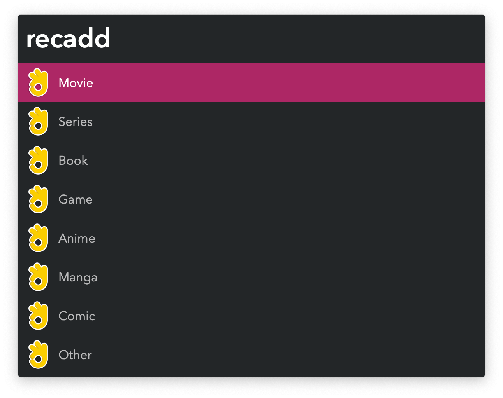

#  Recommendation Nation Alfred Workflow

Track recommendations of media to watch, read, play

[⤓ Install on the Alfred Gallery](https://alfred.app/workflows/vitor/recommendation-nation)

## Usage

Add movies, books, games, and more to a list via the `recadd` keyword. A category and title are required, but the recommender and why it was iteresting to you are optional.

Search through your list with the `recview` keyword.

* <kbd>↩&#xFE0E;</kbd> Open a search for the recommendation. Define preferred websites for each category in the [Workflow’s Configuration](https://www.alfredapp.com/help/workflows/user-configuration/).
* <kbd>⌘</kbd><kbd>↩&#xFE0E;</kbd> Delete recommendation.
* <kbd>⌥</kbd><kbd>↩&#xFE0E;</kbd> Edit recommendation.
